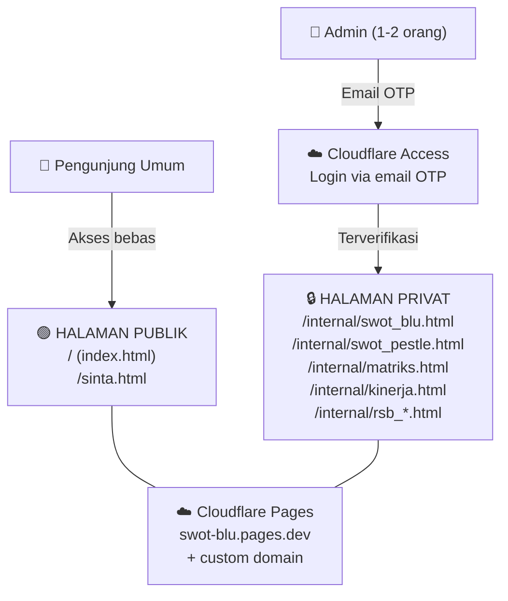

# Arsitektur Baru: Cloudflare Pages + Access

## Ringkasan Arsitektur



---

## Kenapa Cloudflare Pages + Access?

| Aspek | Detail |
|-------|--------|
| **Biaya** | 🆓 Gratis (Free tier: 500 build/bulan, 50 user Access) |
| **Keamanan** | Enterprise-grade — email OTP, bukan password di JS |
| **Setup** | Mudah — connect ke GitHub repo, deploy otomatis |
| **Login** | Email OTP (kode dikirim ke email terdaftar) |
| **User limit** | Sampai 50 user (kita butuh 1-2 saja) |
| **Custom domain** | ✅ Bisa pakai domain sendiri |
| **HTTPS** | ✅ Otomatis |

---

## Struktur Folder Baru

```
swot-blu-uin-ponorogo/
├── index.html                 🟢 PUBLIK — Dashboard Peta PTKIN
├── sinta.html                 🟢 PUBLIK — Dashboard SINTA  
├── app.js                     🟢 PUBLIK — Logika dashboard
├── style.css                  🟢 PUBLIK — Stylesheet
├── data.js                    🟢 PUBLIK — Data 15 PTKIN (sanitasi UKT)
├── sinta_data.js              🟢 PUBLIK — Data SINTA (publik)
├── sinta_data.json            🟢 PUBLIK
├── sinta_extractor.html       🟢 PUBLIK — Tool ekstraksi
│
├── internal/                  🔒 DILINDUNGI CLOUDFLARE ACCESS
│   ├── index.html             🔒 Portal navigasi internal
│   ├── swot_blu.html          🔒 SWOT 7 Dimensi + Kuadran
│   ├── swot_pestle.html       🔒 PESTLE 6 Dimensi + Kuadran
│   ├── matriks.html           🔒 IFAS/EFAS Interaktif
│   ├── kinerja.html           🔒 60+ KPI Dashboard
│   ├── rsb_peta.html          🔒 17 Jalur PNBP
│   ├── rsb_dokumen.html       🔒 Editor Dokumen RSB
│   ├── rsb_generator.html     🔒 Report Builder RSB
│   └── rsb_laporan.html       🔒 Status Tracker RSB
│
├── _headers                   ☁️ Cloudflare config
├── .gitignore                 ⚙️ Exclude: .env, simpeg_raw.html, *.docx, *.pdf
└── README.md                  📖 Dokumentasi proyek
```

> [!IMPORTANT]
> File-file berikut **TIDAK BOLEH** masuk ke repo baru:
> - `simpeg_raw.html` — Data PII 491 PNS (simpan lokal saja)
> - `.env` — API key
> - `Draft RSB.docx/pdf` — Dokumen rahasia
> - `Matriks Kinerja.docx` — Dokumen rahasia
> - `matriks_kinerja_raw.txt` — Data KPI mentah
> - `matriks_raw.html` — Data mentah
> - `data_fetcher.py`, `sinta_fetcher.py`, `fetch_sinta_quartiles.py` — Script internal

---

## Cara Kerja Cloudflare Access

```
Pengunjung buka /internal/swot_blu.html
          │
          ▼
   ┌──────────────┐
   │ Cloudflare    │
   │ Access Check  │
   └──────┬───────┘
          │
    Sudah login?
     /         \
   Ya           Tidak
    │              │
    ▼              ▼
 Tampilkan     Redirect ke
 halaman       halaman login
               (email OTP)
                   │
                   ▼
              Masukkan email
              → Terima kode OTP
              → Masukkan kode
              → ✅ Akses diberikan
              → Cookie sesi aktif
              (tidak perlu login lagi
               selama sesi aktif)
```

---

## Langkah Eksekusi

### Fase 0: DARURAT — Bersihkan Data PII
- [ ] Buat repo GitHub **BARU** yang bersih (history lama mengandung `simpeg_raw.html`)
- [ ] `.gitignore` baru yang ketat
- [ ] **Hapus atau private-kan repo lama** `soleh-hukumline/swot-blu-uin-ponorogo`
- [ ] Simpan `simpeg_raw.html` hanya di lokal (JANGAN commit)

### Fase 1: Reorganisasi File
- [ ] Buat struktur folder baru (`/internal/` untuk halaman privat)
- [ ] Pindahkan halaman privat ke `/internal/`
- [ ] Update semua link navigasi antar halaman
- [ ] Sanitasi `data.js` (hapus data UKT jika sensitif)
- [ ] Buat `/internal/index.html` — portal navigasi internal

### Fase 2: Setup Cloudflare Pages
- [ ] Daftar akun Cloudflare (gratis) jika belum punya
- [ ] Connect repo GitHub baru ke Cloudflare Pages
- [ ] Deploy pertama (semua halaman publik)
- [ ] Verifikasi halaman publik berjalan

### Fase 3: Setup Cloudflare Access
- [ ] Buka Cloudflare Zero Trust dashboard
- [ ] Buat Access Policy:
  - **Nama:** Internal BLU Analytics
  - **Path:** `/internal/*`
  - **Rule:** Allow → Email tertentu saja
  - **Email 1:** `wahid@uinponorogo.ac.id`
  - **Email 2:** (email admin ke-2 jika ada)
- [ ] Test login — buka `/internal/swot_blu.html` → harus minta OTP
- [ ] Verifikasi halaman publik tetap terbuka tanpa login

### Fase 4: Polish & Go Live
- [ ] Custom domain (opsional)
- [ ] Verifikasi semua link navigasi benar
- [ ] Test semua fitur (export PNG, localStorage, chart)
- [ ] Hapus/private-kan repo lama di GitHub

---

## Open Questions

> [!IMPORTANT]
> Perlu keputusan Anda:

1. **Nama repo baru:** Tetap `swot-blu-uin-ponorogo` (setelah hapus yang lama) atau nama baru?

2. **Email untuk login:** `wahid@uinponorogo.ac.id` + siapa lagi? (Cloudflare Access minta email spesifik untuk whitelist)

3. **Custom domain:** Mau pakai domain sendiri (misal: `blu.uinponorogo.ac.id`) atau cukup `swot-blu.pages.dev`?

4. **Data `data.js`:** Apakah UKT dan jumlah dosen per PTKIN boleh publik? Data ini dari PDDikti (publik), tapi formatnya bisa dianggap analisis kompetitif.

5. **Halaman publik:** Apakah `index.html` (peta PTKIN) dan `sinta.html` (dashboard SINTA) memang mau dibuka publik sebagai showcase? Atau mau semua di-private-kan?

---

## Verification Plan

### Automated
```bash
# Cek tidak ada file sensitif di repo baru
git ls-files | grep -E "simpeg|\.env|\.docx|\.pdf|raw"

# Cek tidak ada NIP/data PII di file yang di-commit
grep -rn "NIP\|197[0-9].*0[0-9]" --include="*.html" --include="*.js"
```

### Manual
- [ ] Buka halaman publik tanpa login → harus bisa akses
- [ ] Buka `/internal/*` tanpa login → harus redirect ke login
- [ ] Login dengan email terdaftar → harus bisa akses semua halaman privat
- [ ] Login dengan email TIDAK terdaftar → harus ditolak
- [ ] Test semua fitur: chart, export PNG, PDF, localStorage
