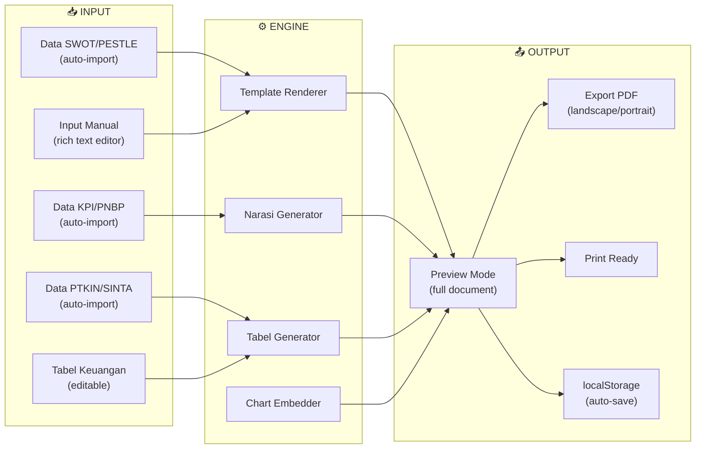

# Redesign RSB Generator — Sesuai PMK 76/2025

## Dasar Hukum
- **PMK 76 Tahun 2025** (Perubahan kedua PMK 129/PMK.05/2020)
- **PER-11/PB/2025** (Tata cara penilaian PPK-BLU)
- Lampiran I, III, IV PMK 76/2025 (format dokumen usulan BLU)

---

## Sistematika Dokumen RSB (5 Bab + Lampiran)

```mermaid
graph TD
    A["📄 DOKUMEN RSB BLU"] --> B["BAB I: Pendahuluan"]
    A --> C["BAB II: Gambaran Umum"]
    A --> D["BAB III: Analisis & Strategi"]
    A --> E["BAB IV: Rencana Bisnis 5 Tahun"]
    A --> F["BAB V: Penutup"]
    A --> G["LAMPIRAN I–IV"]

    B --> B1["Latar Belakang"]
    B --> B2["Landasan Hukum"]
    B --> B3["Tujuan & Manfaat"]
    B --> B4["Sistematika"]

    C --> C1["Sejarah & Profil"]
    C --> C2["Visi, Misi, Tujuan"]
    C --> C3["Tugas Pokok & Fungsi"]
    C --> C4["Kondisi Kinerja Saat Ini"]

    D --> D1["Analisis SWOT / TOWS"]
    D --> D2["Analisis PESTLE"]
    D --> D3["Benchmarking PTKIN"]
    D --> D4["Prioritas Strategis"]

    E --> E1["Program Strategis 5 Tahun"]
    E --> E2["Target KPI / IKU"]
    E --> E3["Proyeksi Keuangan"]
    E --> E4["Rencana SDM & Sarpras"]

    F --> F1["Kesimpulan"]
    F --> F2["Komitmen Pimpinan"]

    G --> G1["Lampiran I: Evaluasi Kinerja"]
    G --> G2["Lampiran II: Program 5 Tahun"]
    G --> G3["Lampiran III: Proyeksi Keuangan"]
    G --> G4["Lampiran IV: Matriks Keterkaitan"]
```

---

## Pemetaan Data: Apa yang Sudah Ada vs Belum Ada

### ✅ Data yang SUDAH TERSEDIA (dari halaman lain)

| Bab | Konten | Sumber Data | Halaman |
|-----|--------|-------------|---------|
| III | Analisis SWOT 7 Dimensi | Hardcoded HTML | `swot_blu.html` |
| III | Analisis PESTLE 6 Dimensi | Hardcoded HTML | `swot_pestle.html` |
| III | Matriks IFAS/EFAS + Kuadran | Editable, in-memory | `matriks.html` |
| III | Benchmarking PTKIN (15 universitas) | `data.js` | `index.html` |
| III | Benchmarking Riset SINTA (16 PTKIN) | `sinta_data.js` | `sinta.html` |
| IV | Target KPI 60+ indikator (2025-2029) | Hardcoded array | `kinerja.html` |
| IV | Peta Potensi PNBP (17 jalur) | Hardcoded HTML | `rsb_peta.html` |
| Lampiran | Checklist kriteria + skor | localStorage | `rsb_checklist.html` |

### ❌ Data yang BELUM ADA (perlu input baru)

| Bab | Konten yang Dibutuhkan | Tipe Input |
|-----|----------------------|------------|
| **I** | Latar belakang transformasi BLU | Rich text editor |
| **I** | Landasan hukum (daftar UU/PP/PMK/Perpres) | Tabel editable |
| **I** | Tujuan & manfaat RSB | Rich text editor |
| **II** | Sejarah singkat UIN Ponorogo | Rich text editor |
| **II** | Visi, Misi resmi UIN | Rich text editor |
| **II** | Struktur organisasi | Rich text / upload gambar |
| **II** | Tugas pokok & fungsi | Rich text editor |
| **II** | Kondisi kinerja 3-5 tahun terakhir | Tabel data tahunan |
| **IV** | Proyeksi keuangan 5 tahun (PNBP, belanja) | Tabel angka |
| **IV** | Rencana pengembangan SDM | Rich text editor |
| **IV** | Rencana pengembangan sarpras | Rich text editor |
| **V** | Kesimpulan | Rich text editor |
| **V** | Komitmen pimpinan | Rich text editor |
| **Lampiran** | Realisasi anggaran (historis) | Tabel angka |
| **Lampiran** | Matriks keterkaitan (cascading) | Tabel editable |

---

## Arsitektur Generator Ideal

### Konsep: **"Smart Auto-Fill + Manual Editing"**

Generator harus bisa:
1. **Auto-import** data dari halaman lain yang sudah terisi
2. **Menyediakan template** untuk bagian yang perlu ditulis manual
3. **Generate narasi** berdasarkan data kuantitatif
4. **Preview & Export** sebagai dokumen siap cetak (PDF/Print)

### Fitur Utama

---

## Open Questions

> [!IMPORTANT]
> Keputusan yang perlu diambil sebelum implementasi:

1. **Apakah Anda memiliki salinan PMK 76/2025 (PDF)?** Saya bisa menyesuaikan format lampiran persis sesuai regulasi terbaru jika ada filenya.

2. **Apakah generator harus bisa auto-import data dari halaman SWOT/PESTLE/KPI?** Atau cukup copy-paste manual? (Auto-import lebih canggih tapi perlu refactor data dari HTML ke JavaScript)

3. **Seberapa jauh level "generate" yang diinginkan?**
   - Level 1: **Template kosong** — hanya menyediakan struktur bab/sub-bab
   - Level 2: **Template + auto-fill data** — isi otomatis dari data yang ada, sisanya manual
   - Level 3: **Full narasi AI-assisted** — generate narasi draf berdasarkan data (perlu API AI)

4. **Format export:** Cukup **Print/PDF dari browser**, atau perlu **DOCX** (Word)?

5. **Bagian mana yang paling prioritas?** BAB III (Analisis & Strategi) sudah paling banyak datanya — mau mulai dari situ?

---

## Rencana Eksekusi (Jika Disetujui)

### Fase 1: Restructure Data
- [ ] Refactor data SWOT dari hardcoded HTML ke JavaScript objects
- [ ] Buat `rsb_data.js` — central data store untuk semua input RSB
- [ ] Import data KPI, PNBP dari file existing

### Fase 2: Build Generator Engine
- [ ] Sidebar navigasi per BAB (sticky)
- [ ] Template renderer per section
- [ ] Rich text editor per sub-section
- [ ] Editable tables untuk data keuangan
- [ ] Auto-save ke localStorage

### Fase 3: Auto-Fill & Preview
- [ ] Auto-fill BAB III dari data SWOT/PESTLE/IFAS-EFAS
- [ ] Auto-fill BAB IV dari data KPI/PNBP
- [ ] Preview mode (full document, print-ready)
- [ ] Export PDF via jsPDF atau window.print()

### Fase 4: Polish
- [ ] Cross-reference dengan checklist RSB
- [ ] Validasi completeness per section
- [ ] Professional print styling
